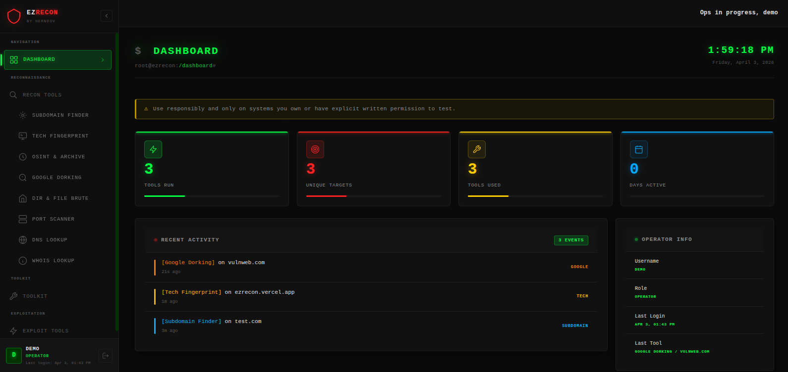

# EZRECON

A full-stack penetration testing and reconnaissance suite for security professionals. Provides an integrated web platform for passive/active recon, vulnerability discovery, payload generation, and OSINT research.

**Live:** [https://ezrecon.vercel.app](https://ezrecon.vercel.app)

---

## Try It Out

Visit [https://ezrecon.vercel.app](https://ezrecon.vercel.app) and click **"Try Demo"** on the login page to access the platform instantly — no account required.

> Demo accounts have restricted access to profile and settings pages.

---

## Features

### Reconnaissance
- **Subdomain Enumeration** — Passive discovery across 6 sources (crt.sh, HackerTarget, AlienVault OTX, URLScan, Anubis, RapidDNS) with DNS resolution
- **Technology Fingerprinting** — Detect CMS, JS frameworks, server software, and more
- **OSINT Archive** — Query Internet Archive (Wayback Machine) and Common Crawl
- **Google Dorking** — Generate and run targeted Google dork queries
- **Directory Brute-force** — Hidden directory/file enumeration with 404 baseline fingerprinting and configurable wordlists
- **Port Scanner** — TCP port enumeration on target hosts
- **DNS Lookup** — Full DNS record resolution
- **WHOIS Lookup** — Domain registration info

### Exploitation Tools
- **Payload Generator** — XSS, SQLi, CMDi, LFI, XXE, SSRF, HTML, and PHP payload fuzzing with configurable injection points
- **Reverse Shell Generator** — Multi-framework reverse shell templates (Bash, Python, PHP, Node.js, and more)

### Utility Tools
- Hash Generator (MD5, SHA1, SHA256, etc.)
- JWT Decoder
- API Key Checker
- Encoder/Decoder
- JSON Beautifier
- Password Generator
- CIDR Calculator
- HMAC Generator

---

## Tech Stack

| Layer | Technology |
|-------|------------|
| Frontend | React 18, Vite, React Router |
| Backend | Node.js, Express.js |
| Database | Firebase Firestore |
| Auth | JWT + bcryptjs |
| Deployment | Vercel (SPA + Serverless Functions) |

---

## Security Notice

EZRECON is intended for **authorized penetration testing only**. Only use these tools against systems you own or have explicit written permission to test. Unauthorized use may violate computer fraud laws in your jurisdiction.

